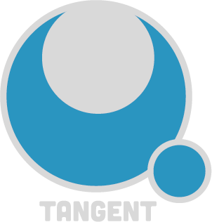

A keyframe animation tool for game developers. 

## Features

### Editing

- Inverse Kinematic Bones
- Forward Kinematic Bones
- Sprite Layering
- Sprite Scaling
- Sprite Rotation
- Sprite Offsetting

Keyframes with **29** easing options!

### Export Options
- JSON
- GIF
- Multiple PNGs

***Easing Options***
- ***Ease In Sine***
- ***Ease In Sine***
- ***Ease Out Sine***
- ***Ease In Quad***
- ***Ease Out Quad***
- ***Ease In Out Quad***
- ***Ease In Cubic***
- ***Ease Out Cubic***
- ***Ease In OutCubic***
- ***Ease In Quart***
- ***Ease Out Quart***
- ***Ease In Out Quart***
- ***Ease In Quint***
- ***Ease Out Quint***
- ***Ease In Out Quint***
- ***Ease In Expo***
- ***Ease Out Expo***
- ***Ease In Out Expo***
- ***Ease In Circ***
- ***Ease Out Circ***
- ***Ease In Out Circ***
- ***Ease In Back***
- ***Ease Out Back***
- ***Ease In Out Back***
- ***Ease In Elastic***
- ***Ease Out Elastic***
- ***Ease In Out Elastic***
- ***Ease Out Bounce***
- ***Ease In Bounce***
- ***Ease In Out Bounce***
